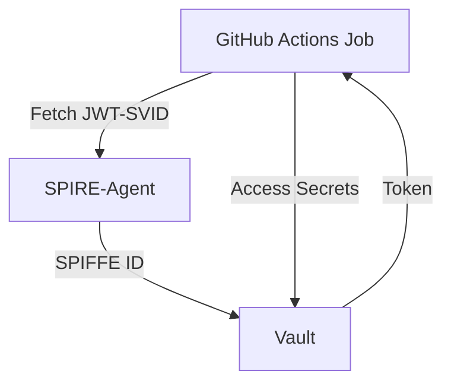

# 🔧 GitHub Actions – Zero-Trust CI/CD Deployment

This folder contains the GitHub Actions workflow to enable **Zero-Trust deployments** using:

- **SPIFFE/SPIRE** for workload identity
- **HashiCorp Vault** for secret delivery
- **AWS/Azure** as the target deployment platform

---

## 🔐 Identity-based Authentication Flow

---

### Key Steps in the Workflow

- Install SPIRE CLI: Needed to fetch JWT-SVID from SPIRE Agent.
- Fetch SPIFFE Identity: Uses spire-agent api fetch jwt.
- Authenticate to Vault: Vault uses SPIFFE JWT-SVID to issue a Vault token.
- Access Secrets: Secrets accessed dynamically using the token.

---

📁 Secret Path Used

Azure: secret/data/azure/github/deploy-params

---

### Local Testing

Run the **aws-deploy.yml** or **azure-deploy.yml** from GitHub or use act for local execution.

---

### References

- Vault JWT Auth Method : https://developer.hashicorp.com/vault/docs/auth/jwt
- SPIRE CLI : https://spiffe.io/docs/latest/spire/cli/
- GitHub Actions : https://docs.github.com/en/actions

